# wafer-level-ic-yield-analysis-jmp
Wafer-level IC yield analysis using JMP for semiconductor pilot manufacturing process comparison.
Wafer-Level IC Yield Analysis During Semiconductor Pilot Manufacturing Using JMP
Project Overview
This project analyzes wafer-level IC yield during the pilot manufacturing stage of a semiconductor manufacturing process. Two process methods are compared:
Method A: Reference manufacturing process
Method B: Faster and lower-cost alternative manufacturing process
The objective is to determine which method provides better yield, evaluate wafer-to-wafer stability, identify spatial failure patterns, and provide an engineering recommendation for further production development.
Dataset Summary
Item	Value
Total wafers analyzed	50
Method A wafers	25
Method B wafers	25
ICs per wafer	1,300
Total IC test records	65,000
Response variable	Passed / Failed
Spatial variables	X Coordinate, Y Coordinate
Analysis software	JMP
Each IC was electrically tested and classified as either Passed or Failed. X-Y die coordinates were used to create wafer-level spatial yield maps.
Project Objectives
Compare overall IC yield between Method A and Method B
Calculate 95% confidence intervals for IC yield
Test whether the yield difference is statistically significant
Analyze wafer-to-wafer yield variation
Create wafer-level pass/fail heat maps
Identify spatial failure patterns across wafers
Compare center, middle, and edge wafer regions
Rank the best and worst wafers based on wafer-level yield
Provide an engineering recommendation for process selection
Tools and Techniques Used
JMP Statistical Software
Distribution Analysis
Confidence Intervals for Proportions
Two-Sample Proportion Test
Contingency Analysis
Mosaic Plot
Graph Builder
Wafer-Level Heat Maps
Radial Distance-Based Region Analysis
Wafer-Level Yield Ranking
Overall Yield Comparison
The overall yield comparison showed that Method A produced higher IC yield than Method B.
Method	Passed ICs	Total ICs	Yield
Method A	18,385	32,500	56.57%
Method B	11,330	32,500	34.86%
Method A outperformed Method B by:
56.57% − 34.86% = 21.71 percentage points
This corresponds to 7,055 more passing ICs for Method A compared with Method B for the same number of tested ICs.
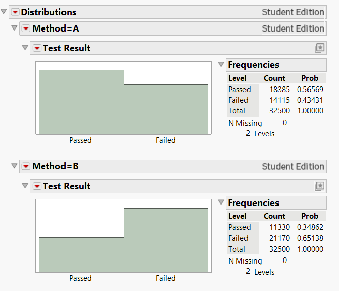
95% Confidence Interval Analysis
95% confidence intervals were calculated for the yield of each method.
Method	Yield	95% Confidence Interval
Method A	56.57%	56.03% to 57.11%
Method B	34.86%	34.35% to 35.38%
The confidence intervals do not overlap, indicating a clear difference between the two process methods.
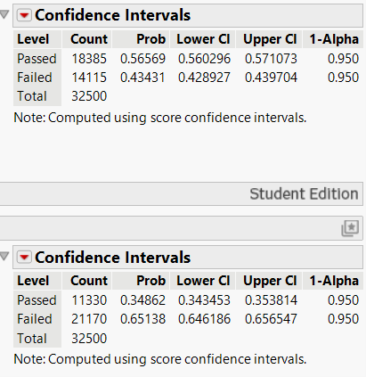
Statistical Comparison Between Methods
A two-sample proportion comparison was used to directly compare the yield difference between Method A and Method B.
Key results:
Yield difference: 21.71 percentage points
95% confidence interval for yield difference: 20.96 to 22.45 percentage points
p-value: < 0.0001
Method A yield was approximately 1.62 times Method B yield
This confirms that the yield difference is statistically significant.
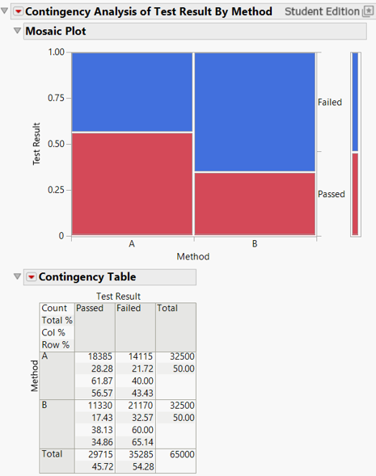
Wafer-to-Wafer Yield Variation
Wafer-to-wafer analysis was performed to check whether each method was stable across its 25 wafers.
Method A showed relatively stable wafer-level yield, with most wafers in the mid-to-high 50% range. Method B showed lower yield and higher wafer-to-wafer variation, with most wafers in the 30% to 40% range.
This indicates that Method B has a systematic process-level yield issue rather than only a few isolated bad wafers.
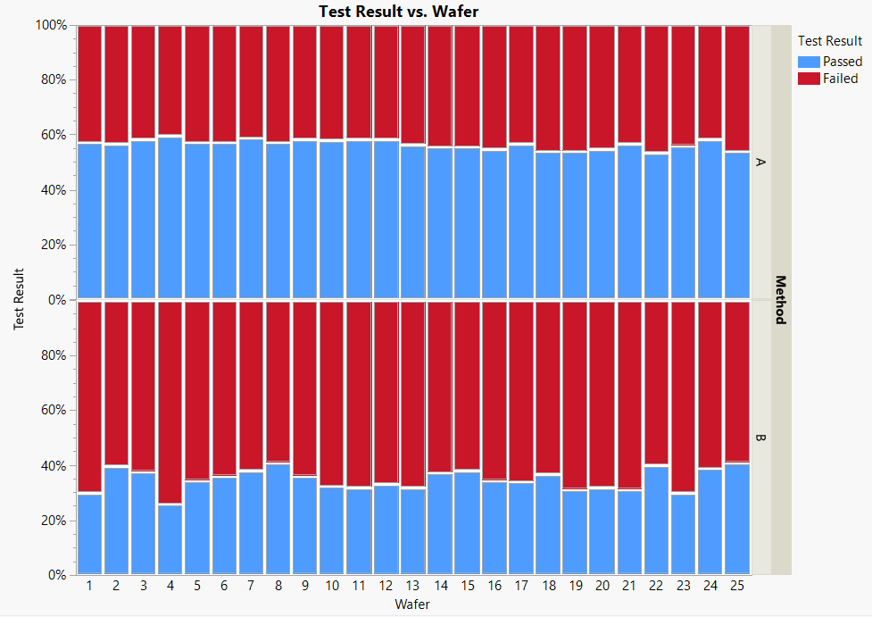
Wafer Map and Spatial Failure Pattern Analysis
Wafer-level heat maps were created using X-Y die coordinates. The maps show pass/fail results across the wafer surface.
Method A Wafer Map
Method A showed a larger passing region, especially near the wafer center. However, failures were still observed near the wafer edge, especially along the right and lower edge regions.
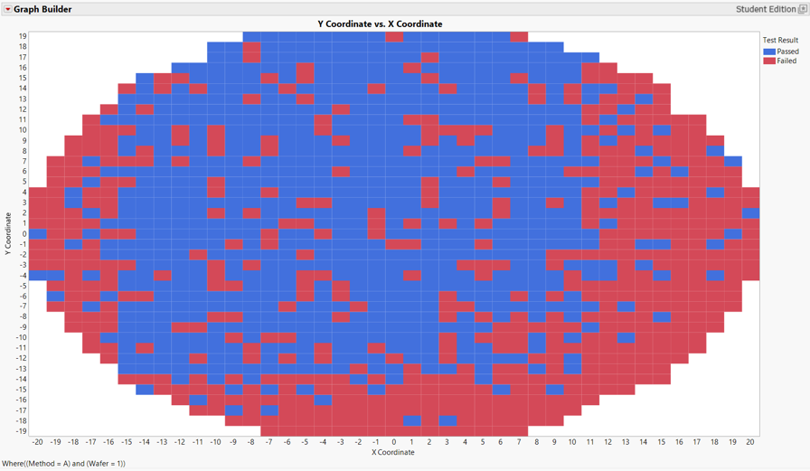
Method B Wafer Map
Method B showed a much larger failed region. Passing ICs were mostly concentrated near the center of the wafer, while the edge region showed severe yield loss.
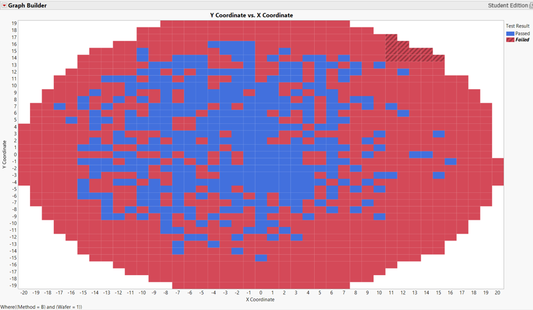
Heat Map of All 50 Wafers
Across nearly all wafers, Method A had a larger pass region than Method B. Method B consistently showed stronger edge-related yield loss.
The heat maps confirmed the numerical yield results:
Method A yield: 56.57%
Method B yield: 34.86%
The main spatial trend was:
Center Yield > Middle Yield > Edge Yield
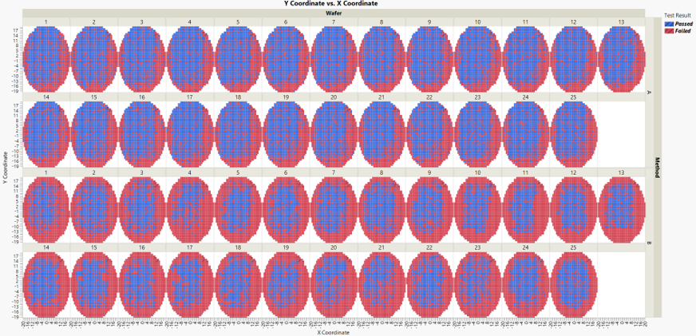
Center, Middle, and Edge Yield Analysis
To quantify the spatial yield pattern, each die was classified into one of three wafer regions based on radial distance from the wafer center:
Center
Middle
Edge
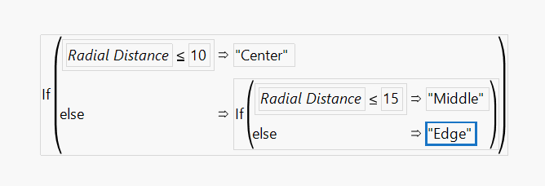
Regional Yield Results
Region	Method A Yield	Method B Yield	Method A Advantage
Center	80.90%	72.90%	+8.00 percentage points
Middle	66.08%	45.39%	+20.69 percentage points
Edge	37.21%	7.48%	+29.73 percentage points
Both methods showed a center-to-edge yield drop, but the drop was much more severe for Method B.
Method B had extremely low edge yield, indicating strong edge-related process nonuniformity.
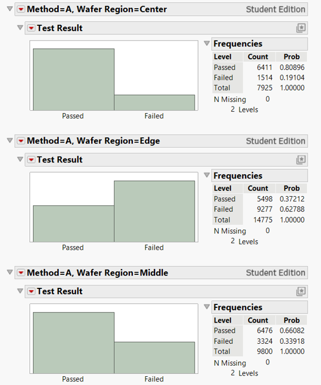
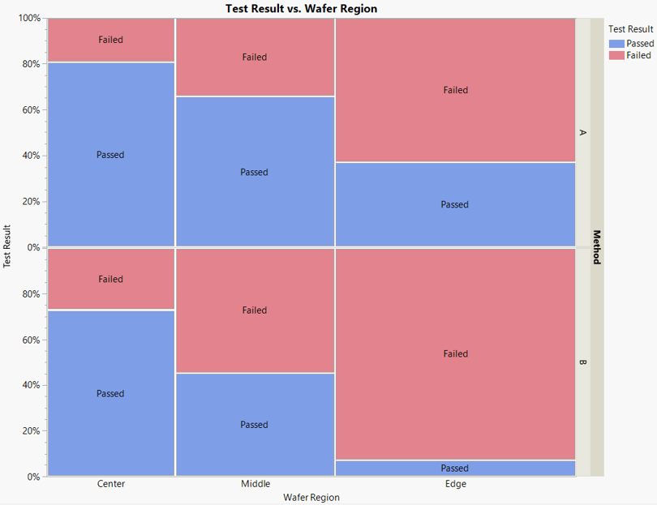
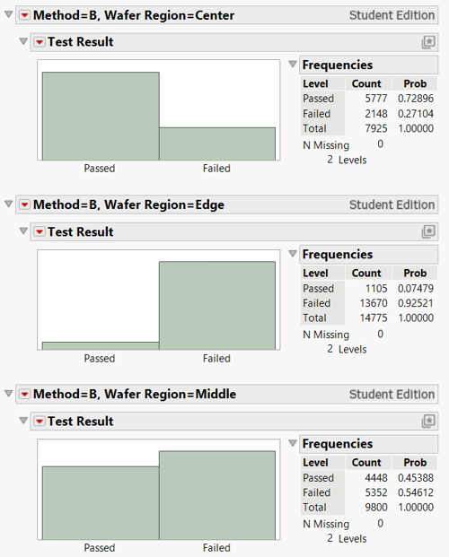
Best and Worst Wafer Ranking
A pass indicator was created where:
Passed = 1
Failed = 0
The average pass indicator for each wafer was used as wafer-level yield.
Category	Method	Wafer	Wafer Yield	Approx. Passed ICs
Best overall wafer	A	4	59.38%	772 / 1300
Worst overall wafer	B	4	25.69%	334 / 1300
Best Method A wafer	A	4	59.38%	772 / 1300
Worst Method A wafer	A	22	53.62%	697 / 1300
Best Method B wafer	B	8 / 25	41.00%	533 / 1300
Worst Method B wafer	B	4	25.69%	334 / 1300
The worst Method A wafer still had higher yield than the best Method B wafer, confirming that Method B’s lower yield is systematic.
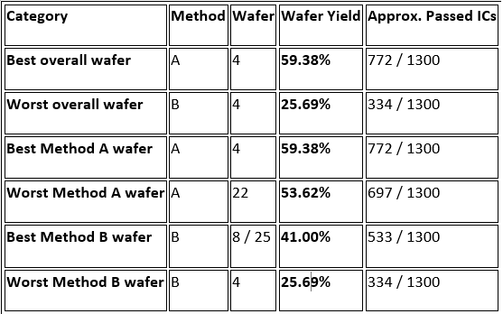
Engineering Recommendation
Based on the analysis, Method A should be selected for further production development.
Although Method B is faster and lower-cost, it produced significantly lower yield, higher wafer-to-wafer variation, and severe edge-related yield loss.
Method B should not be moved to full-scale production without further process optimization. The main improvement area should be reducing edge-region failures and improving across-wafer process uniformity.
Key Takeaways
Method A achieved higher overall yield than Method B.
The yield difference was statistically significant.
Method A produced 7,055 more passing ICs than Method B.
Method B showed stronger edge-related yield loss.
Regional yield analysis confirmed that Method B had severe edge yield degradation.
Wafer ranking showed Method A was more stable across wafers.
JMP was used to support data-driven semiconductor process decision-making.
Skills Demonstrated
Semiconductor yield analysis
Wafer-level process characterization
JMP statistical analysis
Confidence interval interpretation
Two-sample proportion testing
Wafer map interpretation
Spatial failure pattern analysis
Center-to-edge yield analysis
Engineering recommendation based on statistical evidence
Repository Structure
```text
wafer-level-ic-yield-analysis-jmp/
│
├── README.md
├── Figures/
│   ├── 95percent_confidence_intervals.png
│   ├── Overall_yield_distribution_of_both_methods.png
│   ├── Wafer_region_yield_analysis_both_methods.png
│   ├── comparison_betwee_metthod_aandb.png
│   ├── heat_map_methodA.png
│   ├── heat_map_methodB.png
│   ├── heatmap_of_all_50wafers.png
│   ├── overall_wafer_ranking_best_to_worst.png
│   ├── radial_distance_calc_for_wafer_region_analysis.png
│   ├── wafer_region_yield_analysis.png
│   ├── wafer_region_yield_analysis_methodB.png
│   └── wafertowafer_yield_variation.png
│
└── report/
    └── Wafer-Level-IC-Yield-Analysis-Using-JMP.pdf
```
Resume Bullet
Analyzed 65,000 IC-level pass/fail test records from 50 pilot-manufacturing wafers using JMP to compare semiconductor process yield between two manufacturing methods; identified Method A as 21.71 percentage points higher yielding than Method B, with statistically significant improvement, stronger wafer-to-wafer stability, and reduced edge-related spatial yield loss.
